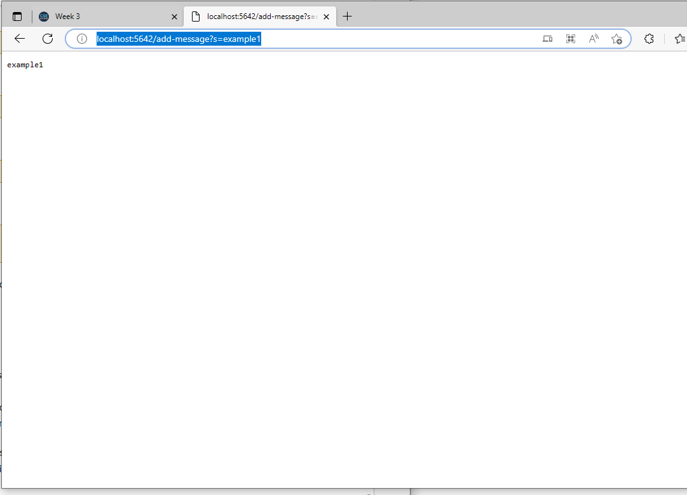
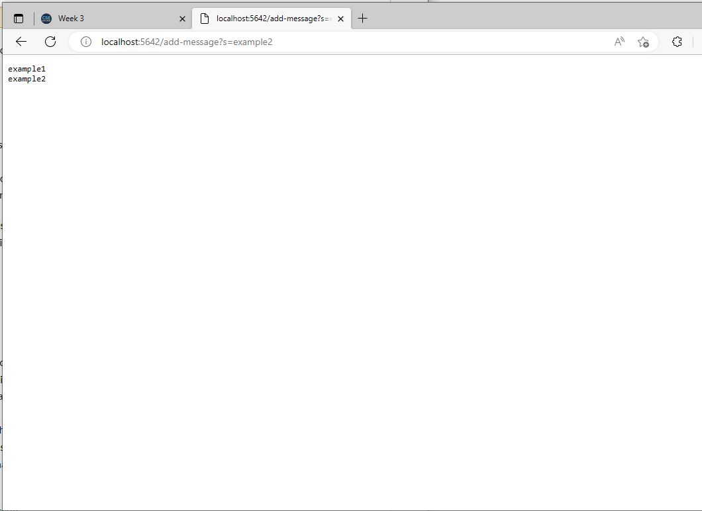

# Lab Report 2

## Part 1 - String Server

For part 1 of the lab report, the assignment was to create a web server called String Server that keeps track of a single string that gets added to by incoming requests. I created this server by expanding off the web server that I created in the Week 2 Lab. 

The code for the lab consists of two files, Server.java and StringServer.java, as can be seen below: cv

### Server.java (supplied as is from the Week 2 Lab)
``` // A simple web server using Java's built-in HttpServer

// Examples from https://dzone.com/articles/simple-http-server-in-java were useful references

import java.io.IOException;
import java.io.OutputStream;
import java.net.InetSocketAddress;
import java.net.URI;

import com.sun.net.httpserver.HttpExchange;
import com.sun.net.httpserver.HttpHandler;
import com.sun.net.httpserver.HttpServer;

interface URLHandler {
    String handleRequest(URI url);
}

class ServerHttpHandler implements HttpHandler {
    URLHandler handler;
    ServerHttpHandler(URLHandler handler) {
      this.handler = handler;
    }
    public void handle(final HttpExchange exchange) throws IOException {
        // form return body after being handled by program
        try {
            String ret = handler.handleRequest(exchange.getRequestURI());
            // form the return string and write it on the browser
            exchange.sendResponseHeaders(200, ret.getBytes().length);
            OutputStream os = exchange.getResponseBody();
            os.write(ret.getBytes());
            os.close();
        } catch(Exception e) {
            String response = e.toString();
            exchange.sendResponseHeaders(500, response.getBytes().length);
            OutputStream os = exchange.getResponseBody();
            os.write(response.getBytes());
            os.close();
        }
    }
}

public class Server {
    public static void start(int port, URLHandler handler) throws IOException {
        HttpServer server = HttpServer.create(new InetSocketAddress(port), 0);

        //create request entrypoint
        server.createContext("/", new ServerHttpHandler(handler));

        //start the server
        server.start();
        System.out.println("Server Started! Visit http://localhost:" + port + " to visit.");
    }
}
```

### StringServer.java (Based on the Week 2 Lab with custom alterations)
```
import java.io.IOException;
import java.net.URI;

class Handler implements URLHandler {
    String savedStrings = "";

    public String handleRequest(URI url) {
        //Home page
        if (url.getPath().equals("/")) {
            return String.format("Welcome to string server! Use /add-message?s=<string> to add to the list of strings stored on this server");
        }
        else 
        {
            System.out.println("Path: " + url.getPath());
            //Add a string to the list
            if (url.getPath().contains("/add-message")) {
                String[] parameters = url.getQuery().split("=");
                if (parameters[0].equals("s")) {
                    //First message
                    if (savedStrings == "")
                    {
                        savedStrings = parameters[1];
                    }
                    //Later messages
                    else
                    {
                        savedStrings = savedStrings + "\n" + parameters[1];
                    }

                    return savedStrings;
                }
            }
            
            //Else if invalid address return error message
            return "404 Not Found!";
        }
    }
}

class StringServer {
    public static void main(String[] args) throws IOException {
        if(args.length == 0){
            System.out.println("Missing port number! Try any number between 1024 to 49151");
            return;
        }

        int port = Integer.parseInt(args[0]);

        Server.start(port, new Handler());
    }
}
```

### String Server Demonstration
Here is a demonstration and explanation of how the program works:

As can be seen in the above screenshot, the program works by going to the web address http://localhost:[your-port]/add-message?s=[your-string] (although replace [your-port] with the port you gave as an argument when starting the program from the command line and replace [your-string] with your desired string. Upon loading the page, the program calls the function `handleRequest()` (the main function in the program in terms of user-end functionality) with the URL as an argument to the function. In this image, this is the first time a "add-message" url was loaded, and as such the string the server stored (the only class field stored in this program) was empty before loading the page. However, upon loading the page, the string "example1" is addded to the stored string. The stored string is then printed out on the webpage which can be seen in the screenshot.

In this screenshot, a very similar url has been called again, except the string this time is "example2" instead of "example1". As before, the URL is passed to `handleRequest()` and "example2" is added to the stored string. The major difference in behavior from the program that can be seen in this screenshot is that the stored string remembered the string from the last screenshot ("example1") as it can be seen printed out before the string that was added in this screenshot.

## Part 2 - Bugs

Not all programs work correctly on the first try. This can be demonstrated with the function reverseInPlace() in Lab 3. The function takes one argument, an int array called `int[] args`, which it changes to be in reverse order. That is, after calling reverseInPlace(), whatever array you pass to it will have it's lowest and highest index item swapped, as well as it's next lowest and next highest, and so forth. However, as implemented, it contains bugs and does not work! This can be seen in the tests of the following screenshot:
[Image](lab3part2.1.png)
Although the first test passes successfully, the next two tests both fail. This can be seen in this screenshot:
[Image](fixedbug.png)
Why is this? Well to understand requires analyzing the code:
```
// Changes the input array to be in reversed order
  static void reverseInPlace(int[] arr) {
    for(int i = 0; i < arr.length; i += 1) {
      arr[i] = arr[arr.length - i - 1];
    }
  }
```
As can be seen, every element in the array is swapped with the opposite element in the array when this function is called. However, as the function progresses linearly through the array without any buffering, the second half of the array will simply swap with it's mirror element which means the second half of the array will remain unchanged! To fix the code, the following changes are required:
```
// Changes the input array to be in reversed order
  static void reverseInPlace(int[] arr) {
    for(int i = 0; i < arr.length; i += 1) { //Change "i < arr.length;" to "i < arr.length / 2;"
      int temp = arr[i]; //added temporary storage buffer
      arr[i] = arr[arr.length - i - 1];
      arr[arr.length - i - 1] = temp; //added secondary swap for back element with mirror buffer
    }
  }
```
As can be seen, in this new bugless function, only the first half of the array is looped through. However, both the front and mirror elements are swapped correctly for each iteration using temporary buffering meaning the array successfully swaps. 

## Part 3 - Learning

One interesting thing that I learned in lab 2 was how URL's work. I learned that a URL actually consists of several components, such as the protocol, the domain name, the path, and the query string. The protocol indicates the type of communication that will be used to access the resource, such as http or https. The domain name is the name of the server that hosts the resource, such as google.com or bing.com. The path is the address to the accessed file on the server (similar to a file path on a local storage system). Finally, the query string contains additional information, such as q=keyword. This was all very useful information that I was glad to have learned.
